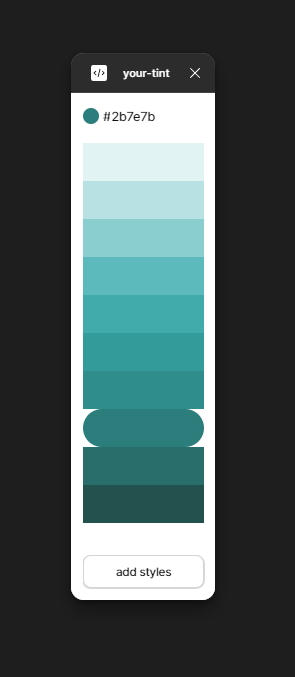

# Your Tint - Figma Plugin

This figma plugin uses the LCH color system to generate the most visually optimal tints for the human eye. It based on the core algorithm from [filipeglfw/material-palette-generator algorithm](https://github.com/filipeglfw/material-palette-generator/blob/master/dist/palette-generator.js#L304) and works similarly to Google's Material Design palette algorithm. (Thanks for the code!)
